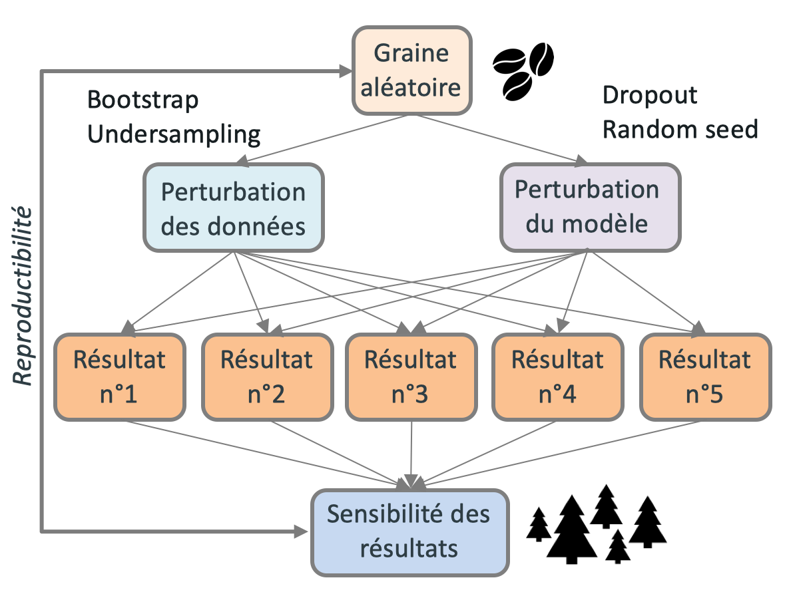

---
jupyter:
  jupytext:
    text_representation:
      extension: .md
      format_name: markdown
      format_version: '1.3'
      jupytext_version: 1.10.2
  kernelspec:
    display_name: decathlon-env
    language: python
    name: decathlon-env
---

# 02 - Forecast model
    Author: corentinv

```python
import sys
sys.path.append('../../')

import pandas as pd
pd.set_option('display.min_rows', 500)
pd.set_option('display.max_rows', 500)
pd.set_option('display.max_columns', 500)
pd.set_option('display.width', 500)
pd.set_option('max_colwidth', 400)

import matplotlib.pyplot as plt
from folium import plugins
import folium

from forecast.application import etl
from forecast.domain import feature_engineering
from forecast.domain.transform import transform
from forecast.domain.forecast  import simple_training, cross_validate, compute_mae_mape_per_points
from forecast.infrastructure.extract import extract_test_set_csv, extract_stores_csv
import forecast.settings as settings

from sklearn.ensemble import RandomForestRegressor
from forecast.domain.multimodel import MultiModel
from sklearn.model_selection import TimeSeriesSplit
from sklearn.base import clone

import yaml
import logging
import logging.config
with open(settings.LOGGING_CONFIGURATION_FILE, 'r') as f:
    logging.config.dictConfig(yaml.safe_load(f.read()))
logging.getLogger('matplotlib.font_manager').disabled = True

```

# Load and clean data 

```python
?etl
```

```python
df = etl(settings.DATA_DIR_RAW)
```

```python
# Info cleaning made 

# Negative turnover
print('Shape negative turnover dataframe', df[df.turnover < 0].turnover.shape)

# Outliers
df \
    .query(f"dpt_num_department == {88}") \
    .groupby(["weekofyear",'year'], as_index=False) \
    .agg({'turnover': sum})\
    .pivot(index='weekofyear', columns='year', values='turnover') \
    .plot(
            figsize=(12,5), 
            xlabel='weekofyear', 
            ylabel='Turnover', 
            title=f'Evolution of turnover for department {88} by year'
)
plt.grid(True)
#plt.xlabel('Turnover')
#plt.title(f'Evolution of turnover for department {88} by year')
```

# Feature engineering

```python
?feature_engineering
```

```python
df_feat = feature_engineering(df, list_features_to_dummy=['dpt_num_department',"zod_idr_zone_dgr"])
```

```python
df_feat.head(2)
```

# Features selected for modeling

```python
features = ['weekofyear_cos_1', 'weekofyear_sin_1', 'x', 'y', 'z', 'dpt_num_department_88', 'dpt_num_department_117', 'dpt_num_department_127', 'zod_idr_zone_dgr_3', 'zod_idr_zone_dgr_4', 'zod_idr_zone_dgr_6', 'zod_idr_zone_dgr_10', 'zod_idr_zone_dgr_35', 'zod_idr_zone_dgr_59', 'zod_idr_zone_dgr_72']
df_feat[features].head(2)
```

# Simple model - Simple learning
    Model: RandomForestRegressor
    Learning method: split train/valid set (validation set corresponding to the 8 more recent dates)
    Metrics: MAE, MAPE/100

```python
model = RandomForestRegressor(n_estimators = 20, max_depth = 30, random_state=42)
```

```python
x_train, x_test, model = simple_training(df_feat, model, features)
```

```python
# Plot results on test set
fig, ax = plt.subplots(figsize=(500,10))
ax.plot(range(x_test.shape[0]), x_test[["turnover","y_pred_simple"]])
plt.grid(True)
plt.title('Evolution of turnover on validation set')
```

# Simple model - TimeSerieSplit learning
    Model: RandomForestRegressor
    Learning method: TimeSerieSplit
    Metrics: MAE, MAPE/100
    


```python
x_train, x_test, model = cross_validate(df_feat, model = model, features=features)
```

# Multimodel - TimeSerieSplit learning
    Model: Mutlimodel with RandomForestRegressor (extract from Yotta)
    Learning method: TimeSerieSplit
    Metrics: MAE, MAPE/100
    


```python
?MultiModel
```

```python
n_fold = 3
n_estimators = 20
max_depth = 30
n_models = 10

model = MultiModel(
        RandomForestRegressor(n_estimators=n_estimators, max_depth = max_depth), 
        n_models=n_models
)
```

```python
x_train, x_test, model = cross_validate(
                                df_feat, 
                                model=model, 
                                features=features, 
                                n_fold = n_fold
)
# x_train, x_test, model = simple_training(df_feat, model, features)
```

```python
preds = pd.DataFrame(
        { 
            'y_pred_simple': x_test['y_pred_simple'],
            'y_pred_min': x_test[[f'y_pred_{i}' for i in range(1,n_models)]].min(axis=1),
            'y_pred_max': x_test[[f'y_pred_{i}' for i in range(1,n_models)]].max(axis=1),
            'turnover': x_test['turnover']
        }
)

# Results on test set
tmp_plot = preds[:50]
fig, ax = plt.subplots(figsize=(30,10))
ax.plot(range(tmp_plot.shape[0]), tmp_plot["turnover"], label ='turnover' )
ax.plot(range(tmp_plot.shape[0]), tmp_plot["y_pred_simple"], label='simple_pred')
ax.fill_between(range(tmp_plot.shape[0]), tmp_plot["y_pred_min"], tmp_plot["y_pred_max"], alpha=0.2)
plt.grid(True)
plt.legend()
```

```python
preds = model.predict(None, df_feat.set_index('day_id')[features])

preds = pd.DataFrame(
    { 
        'y_pred_simple': preds['y_pred_simple'],
        'y_pred_min': preds[[f'y_pred_{i}' for i in range(1,10)]].min(axis=1),
        'y_pred_max': preds[[f'y_pred_{i}' for i in range(1,10)]].max(axis=1)
    }
)

final_output = pd.concat(
    [
        df.set_index('day_id')[['but_num_business_unit','dpt_num_department','turnover']], 
        preds
    ],axis=1)
```

```python
compute_mae_mape_per_points(final_output) \
    .to_csv(settings.DATA_DIR_OUTPUT + '/train_predictions_v3.csv')
```

# Test set - predictions

```python
df_test = extract_test_set_csv(settings.DATA_DIR_RAW)
df_store = extract_stores_csv(settings.DATA_DIR_RAW)
```

```python
df = transform(df_test, df_store, is_train=False)
df_feat = feature_engineering(df, list_features_to_dummy=['dpt_num_department',"zod_idr_zone_dgr"])
preds = model.predict(None, df_feat.set_index('day_id')[features])
```

```python
preds = pd.DataFrame(
            {
                'y_pred_simple': preds['y_pred_simple'],
                'y_pred_min': preds[[f'y_pred_{i}' for i in range(1,10)]].min(axis=1),
                'y_pred_max': preds[[f'y_pred_{i}' for i in range(1,10)]].max(axis=1)
            }
)
```

```python
final_output = pd.concat([df.set_index('day_id')[['but_num_business_unit','dpt_num_department']], preds],axis=1)
final_output.head()
```

```python
# Plot results on test set (50 end rows)
tmp_plot = final_output[:50]
fig, ax = plt.subplots(figsize=(20,10))
ax.plot(range(tmp_plot.shape[0]), tmp_plot["y_pred_simple"], label='simple_pred')
ax.fill_between(range(tmp_plot.shape[0]), tmp_plot["y_pred_min"], tmp_plot["y_pred_max"], alpha=0.5)
plt.title('Prediction on test set (50 end rows)')
plt.grid(True)
plt.legend()
```

```python
final_output.to_csv(settings.DATA_DIR_OUTPUT+'/test_predictions_v2.csv')
```
